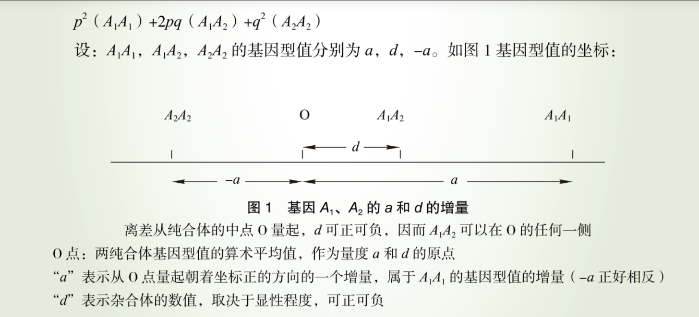
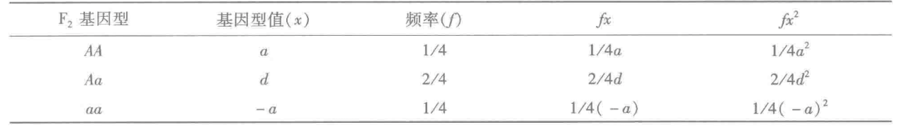
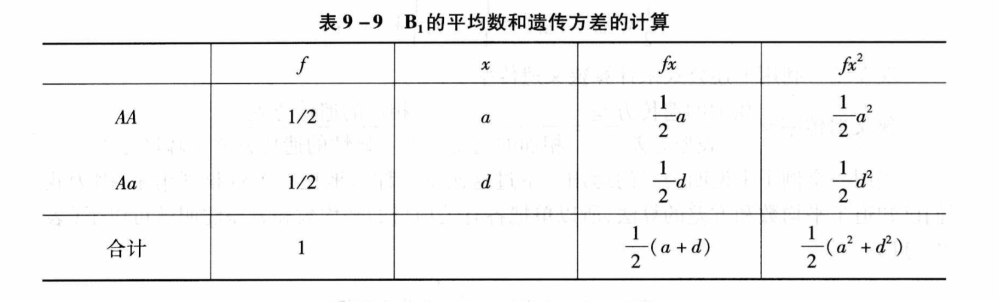
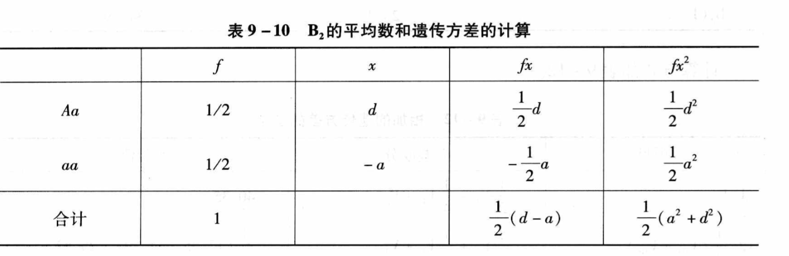
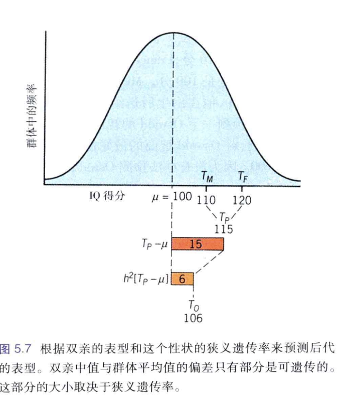
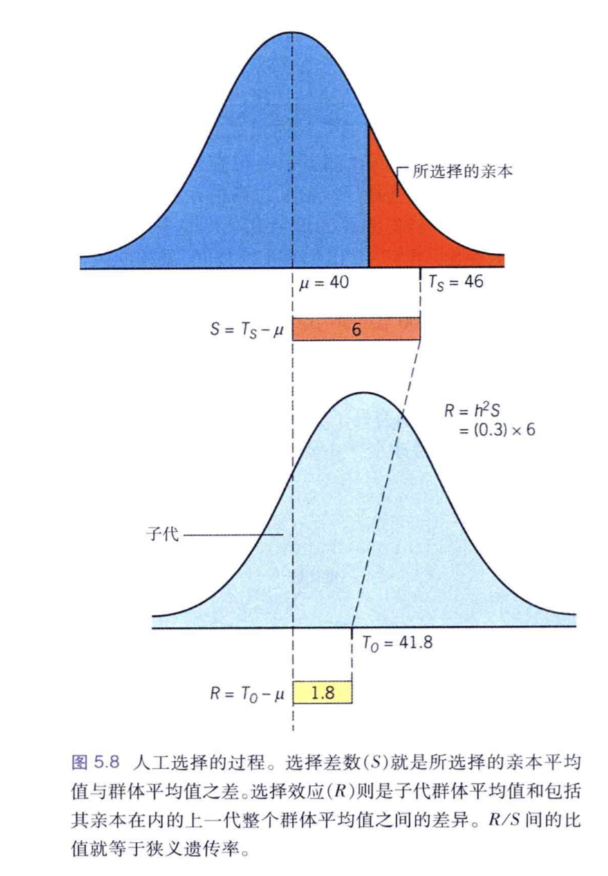

# 数量性状遗传

### 多基因学说
多因一效、一因多效、各效相等（？），多基因形状
#### 数量性状遗传率
定义：
**基因型值**(G)：某基因型对性状数值造成的影响，包括等位基因间的加性(A)、显性效应(D)和非等位基因间的上位效应(I)
满足
$$
G=A+D+I
$$
根据多基因学说，一对等位基因间的基因型值可以如下图给出：

**表型值**(P)：个体某性状实际测量到的数值，包括基因型值(P)与**环境效应**(E) 
满足 
$$
P = G + E
$$

一般地，在育种工作中，由于基因型的纯合化，显性效应将逐渐消失，而上位效应则过于复杂，一般不予分析，通常将显性、上位以及环境影响归入一起，称**剩余值**(R)
有
$$
R=D+I+E
$$
而将加性方差称为**育种值**
考察一个足够大的群体，总表型值满足
$$
\Sigma P = \Sigma G + \Sigma E
$$
因为群体足够大，各有正负的环境效应相互抵消
满足 
$$
\Sigma E =0
$$
故
$$
\overline{P} =\overline{G}
$$
即群体**平均表型值**等于群体**平均基因型值**
这告诉我们全群性状的平均值往往反映了全群该性状的遗传水平

但在任何一个群体中，个体与个体之间均不可避免的存在差异
我们往往希望知道个体之间的差异是由什么原因导致的，即能够**定量地**分析遗传效应与环境效应对于个体间的差异各自占多大的影响
首先我们要量化群体中个体间差异的程度，通常使用**方差**($\sigma^2$)
对于大小已知、各个体均充分了解的整个群体，有：
$$
\sigma^2=\frac{\Sigma f(x-\overline{x})^2}{\Sigma f}
=\Sigma fx^2-\Sigma{(fx)}^2
$$
式中$f$为各基因型个体占比，有$\Sigma f =1$，该式子具体推导不难请自行证明

接着，我们引入**遗传率**(heritability)
**广义遗传率**($h$)被定义为遗传方差($V_G$)与表型方差($V_P$)的比值：
$$
h=\frac{V_G}{V_P}
$$
**狭义遗传率**($H$)被定义为加性方差($V_A$)与表型方差($V_P$)的比值：
$$
H=\frac{V_A}{V_P}
$$
与生物适应型关系低的形状其遗传率往往较高，如人的指纹总嵴数可高达97%

#### 估计遗传率
以一对等位基因，$A_1A_1 \times A_2A_2$为例
亲代平均基因型值分别为$a$与$-a$
$F_1$基因型值为$d$
对于$F_2$代基因型值，有：
由前述方差计算公式带入
有
$$
\sigma_G^2=\Sigma fx^2-\Sigma{(fx)}^2=\frac{1}{2}a^2+\frac14d^2
$$
如果有$n$对互不连锁、控制统一性状的基因，其作用具有可加性：
$$
V_G=\frac12\Sigma a^2+\frac14\Sigma d^2
$$
令加性方差：$V_A=\Sigma a^2$
   显性离差：$V_D=\Sigma d^2$
则
$$
V_G=\frac12V_A+\frac14V_D
$$
显然：
$$
V_P=\frac12V_A+\frac14V_G+V_E
$$
我们知道，一致性群体(纯合体)不存在$V_G$，因此使用$\frac13(V_{P_1}+V_{P_2}+V_{F_1})$估计$V_E$
进而可以计算$V_G$与$H$

对于狭义遗传率，则需要借助$F_1$分别与两亲本回交产生的$B_1$与$B_2$

$$
V_{B_1}=\frac12(a^2+d^2)-\frac14(a+d)^2+V_E=\frac14(a^2-2ad+d^2)+V_E
$$

$$
V_{B_2}=\frac12(a^2+d^2)-\frac14(d-a)^2+V_E=\frac14(a^2+2ad+d^2)+V_E
$$
因此：
$$
\frac12(V_{B_1}+V_{B_2})=\frac14V_A+\frac14V_D+V_E
$$
进而可计算$h$与**平均显性程度**
$$
\frac{d}{a}=\sqrt{\frac{V_D}{V_A}}
$$

#### 遗传率的意义
类似上面所做的计算再结合一些统计学推导可以知道：
$$
h^2=\frac{r_{P_1P_2}}{r_A}
$$
其中：
 $r_{P_1P_2}$表示亲属1与亲属2间该性状表型的**相关系数**
 $r_A$表示亲属1与亲属2的**亲缘系数**(遗传相关系数)

如亲代(P)与子女(O)间：$h^2=\frac{r_{OP}}{0.5+0.5}=r_{OP}$
注意：
- 考虑亲代子代之间时应当抽象为亲代是一“个体”，它的自交产生了子代（即子代所有遗传物质均来自于亲代，亲子代间亲缘系数应当为1）
- 这样理解的含义是单独父本或母本与后代的亲缘系数是0.5，但亲本整体与后代的亲缘系数是1

由**回归系数(斜率)**
的最小二乘估计：
$$
b=\frac{SS_{ab}}{\sqrt{SS_a\cdot SS_b}}
$$

与**相关系数**：$r_{OP}=\frac{{SS}_{op}}{SS_p}$比较，可以得到在群体标准差一致或子代生长群体平均值已知时有
$$
SS_a=N\cdot\sigma_a^2=N\cdot\sigma_b^2=SS_b \leftrightarrow r=b
$$

因此：
$$
h^2=\frac{r_{P_1P_2}}{r_A}=r_{OP}=b_{OP}
$$
其中$P_M$代表双亲中值，用T表示表型值，则有：
$$
T_{P_M}=\frac12(T_{P_1}+T_{P_2})
$$

进而：
$$
T_O=\mu+h^2(T_{P_M}-\mu)
$$
或：
$$
[T_O-\mu]=h^2[T_{P_M}-\mu]
$$
注意：照应上文，此处所使用的亲代值为双亲平均，而非单独的父本或母本，如果单独使用父本或母本，$h^2$应当等于2倍父本或母本与后代间的相关系数，所得公式应当是
$$
[T_O-\mu]=\frac12 \times h^2[T_{Fa/Mo}-\mu]
$$
##### 人工选择
在一个亲本不变，指定另一亲本($P_S$)或选定一定表型亲本($P_S$)互相交配时，则有：
$$
[T_O-\mu]=h^2[T_{P_S}-\mu]
$$

上述公式允许我们在生长群体平均值已知(提供环境效应的信息)、亲本平均值已知(提供遗传效应的信息)的情况下根据遗传率预测子代的表型平均值
例如：

